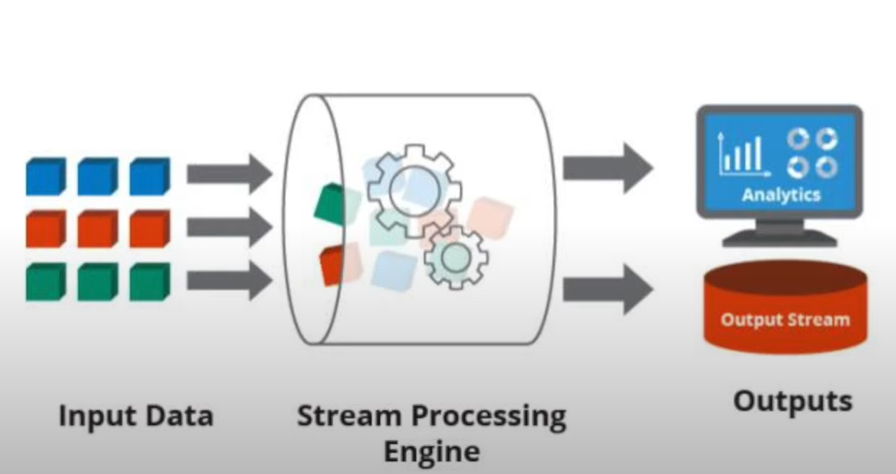
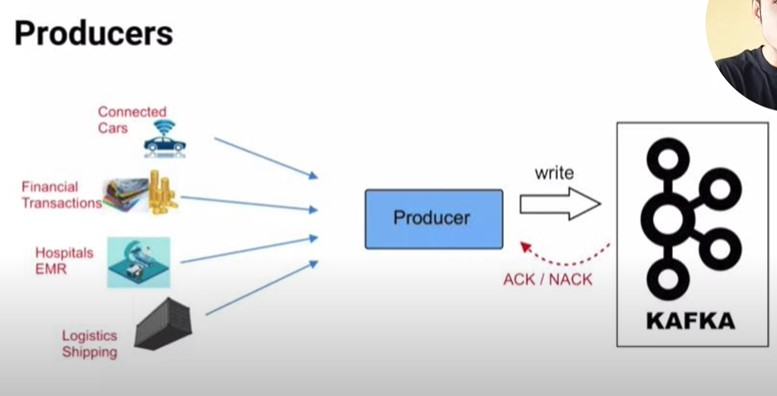
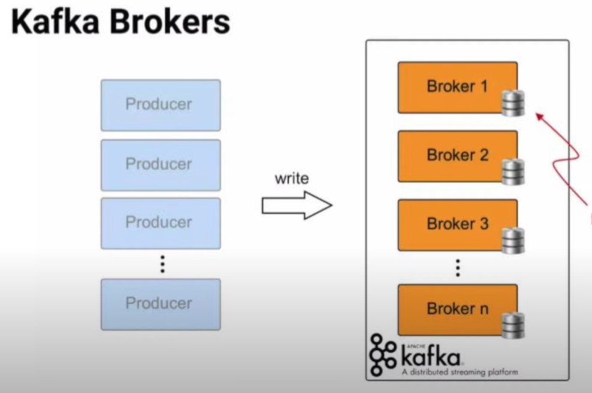
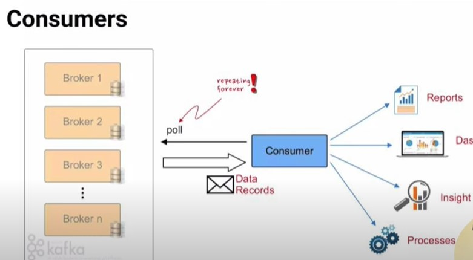
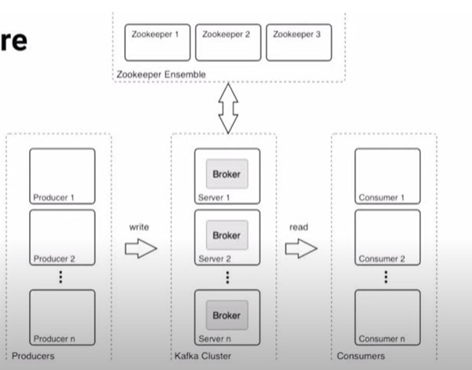
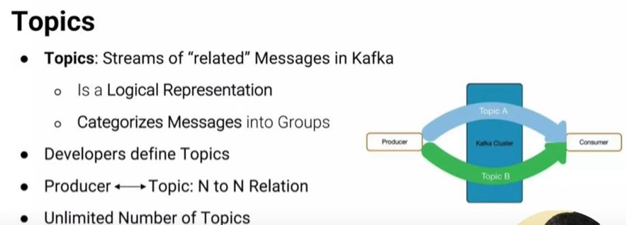
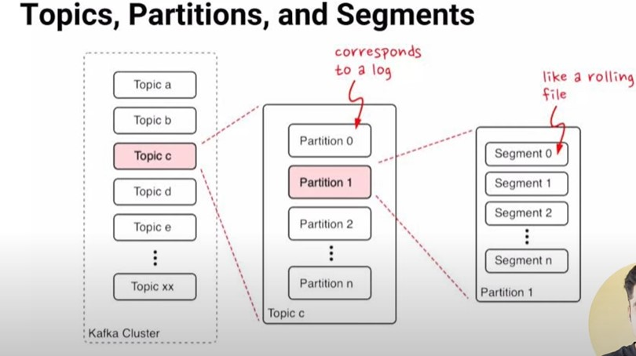
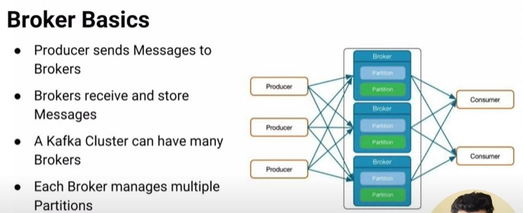
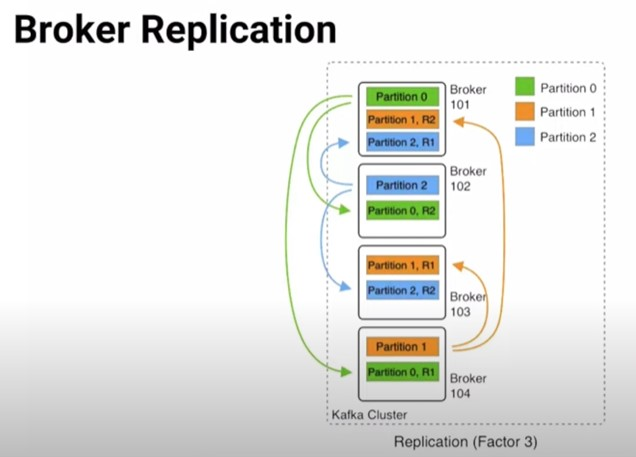
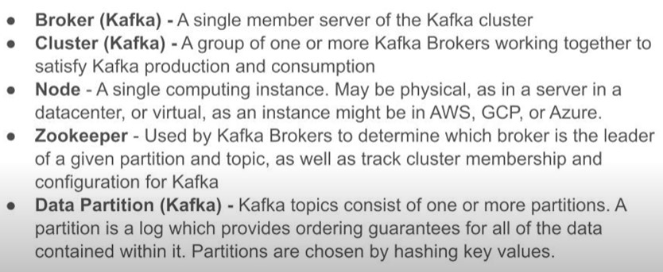

# Real Time Stock Market Data Processing Engine using Kafka Data Engineering Project

## Introduction 
Aim: Develop an End-To-End Data Engineering Project on Real-Time Stock Market Data using Kafka.
Implement and execute solution using Python, Amazon Web Services (AWS), Apache Kafka, Glue, Athena, and SQL.

## Architecture 

## Technology Used
- Programming Language - Python
- Amazon Web Service (AWS)

1. S3 (Simple Storage Service)
2. Athena
3. Glue Crawler
4. Glue Catalog
5. EC2

- Apache Kafka

## Dataset 
Operational Data Engineering - Building an end-to-end data pipeline using the following dataset

https://github.com/darshilparmar/stock-market-kafka-data-engineering-project/blob/main/indexProcessed.csv

## Kafka

Apache Kafka is a distributed event store and stream-process platform

Kafka is a distributed system consisting of servers and clients that communicate via a high-performance TCP network protocol

Stream processing is the act of performing continual calculations on potentially endless and constantly evolving sources of data (Real-time streaming and notification)

Producer is a client application that publishes (writes) events to a Kafka cluster

Producers produce data, for instance, data from sensors, data from the stock market, data from web analytics

A Kafka broker is a single node / server / broker in the cluster this will receive and send the data.
Multiple brokers created a cluster

Consumer is a client application that subscribes to (reads and processes) events

Kafka Architecture

ZooKeeper is used in distributed systems for service synchronization and as a naming registry.  When working with Apache Kafka, ZooKeeper is primarily used to track the status of nodes in the Kafka cluster and maintain a list of Kafka topics and messages.  

Zooekeeper Ensemble contains Zoekeeper
Role is Cluster Management, Failure detection and recover, and Store ACLs (Access Control Lists) and secrets

- Open Source Apache Project
- Distributed Key Value Store
- Maintains configuration information
- Store ACLs (Access Control Lists) and secrets
- Enables highly reliable distributed coordination
- Provides distributed synchronization

Topics are Virtual Groups or Logs that hold messages and events in a logical order, allowing users to send and receive data between Kafka Servers with ease.

Kafka stores messages in an ordered data structure called logs.

Summary

Producer
- Producers write Data as Messages
- Can be written in any language Java, C/C++, Python, Go, .NET, JMS REST Server for any unsupported language
- Command Line Producer Tool

Consumer
- Consumers pull messages from 1..n topics
- New inflowing messages are automatically retrieved 
- Consumer offset
	keeps track of the last message read
	Is stored in special topic
- CLI tools exist to read from cluster

