# Real Time Stock Market Data Processing Engine using Kafka Data Engineering Project

## Introduction 
Aim: Develop an End-To-End Data Engineering Project on Real-Time Stock Market Data using Kafka.
Implement and execute solution using Python, Amazon Web Services (AWS), Apache Kafka, Glue, Athena, and SQL.

## Architecture 

## Technology Used
- Programming Language - Python
- Amazon Web Service (AWS)

1. S3 (Simple Storage Service)
2. Athena
3. Glue Crawler
4. Glue Catalog
5. EC2

- Apache Kafka

## Dataset 
Operational Data Engineering - Building an end-to-end data pipeline using the following dataset

https://github.com/darshilparmar/stock-market-kafka-data-engineering-project/blob/main/indexProcessed.csv

## Kafka

Apache Kafka is a distributed event store and stream-process platform.
Apache Kafka consists of a storage layer and a compute layer that combines efficient, real-time data ingestion, streaming data pipelines, and storage across distributed systems

- Data Pipelines - In the context of Apache Kafka, a streaming data pipeline means ingesting the data from sources into Kafka as it's created and then streaming that data from Kafka to one or more targets

- Stream Processing - Stream processing includes operations like filters, joins, maps, aggregations, and other transformations which enterprises leverage to power many use-cases. Kafka Streams is a stream processing library built for Apache Kafka enabling enterprises to process data in real-time

- Streaming Analytics - Kafka provides high throughput event delivery, and when combined with open-source technologies such as Druid can form a powerful Streaming Analytics Manager (SAM). Druid consumes streaming data from Kafka to enable analytical queries. Events are first loaded in Kafka, where they are buffered in Kafka brokers before they are consumed by Druid real-time workers

- Streaming ETL - Real-time ETL with Kafka combines different components and features such as Kafka Connect source and sink connectors to consume and produce data from/to any other database, application, or API, Single Message Transform (SMT) – an optional Kafka Connect feature, Kafka Streams for continuous data processing in real-time at scale

- Event-Driven Microservices - Apache Kafka is the most popular tool for microservices because it solves many of the issues of microservices orchestration while enabling attributes that microservices aim to achieve, such as scalability, efficiency, and speed. It also facilitates inter-service communication while preserving ultra-low latency and fault tolerance

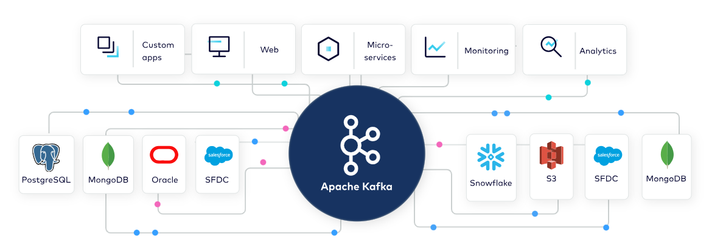

Kafka is a distributed system consisting of servers and clients that communicate via a high-performance TCP network protocol. Stream processing is the act of performing continual calculations on potentially endless and constantly evolving sources of data (Real-time streaming and notification)

## Kafka Architecture

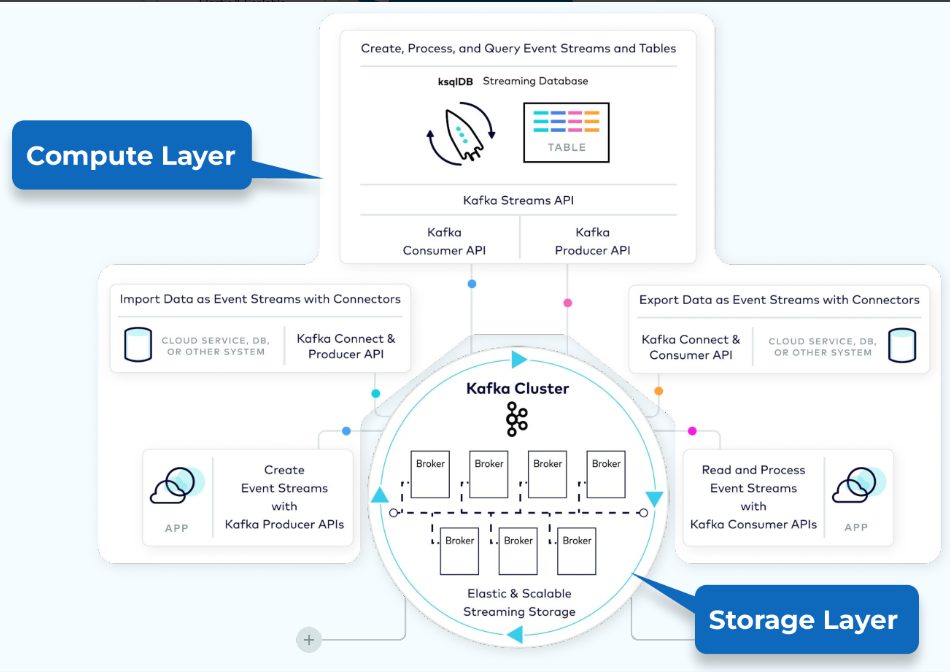

The producer API for writing events and the consumer API for reading them. On top of these are APIs built for integration and processing

An Apache Kafka® Consumer is a client application that subscribes to (reads and processes) events

The Kafka consumer works by issuing “fetch” requests to the brokers leading the partitions it wants to consume. The consumer offset is specified in the log with each request. The consumer receives back a chunk of log beginning from the offset position. The consumer has significant control over this position and can rewind it to re-consume data if desired

An Apache Kafka® Producer is a client application that publishes (writes) events to a Kafka cluster

A producer partitioner maps each message to a topic partition, and the producer sends a produce request to the leader of that partition. The partitioners shipped with Kafka guarantee that all messages with the same non-empty key will be sent to the same partition

## Kafka Cluster

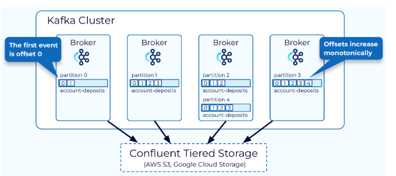

Kafka uses partitions to distribute storage and processing of events in a topic. Each topic consists of multiple partitions spread across nodes in the Kafka cluster. Partitions serve as the primary unit of storage and parallelism. Events can be produced and consumed in parallel by writing to and reading from different partitions.

Within a partition, events are assigned unique identifiers called offsets. These offsets continuously increase as new events are added and are never reused. Offsets are utilized by consumers to track the processing progress and determine which events have been processed

## Kafka Topics

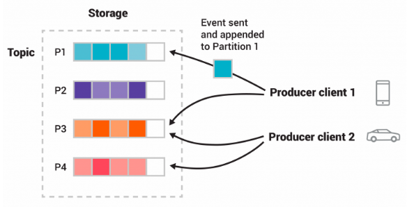

Topics are Virtual Groups or Logs that hold messages and events in a logical order, allowing users to send and receive data between Kafka Servers with ease

Topics in Kafka are always multi-producer and multi-subscriber

Kafka partitions topics across multiple brokers to achieve scalability. This distributed placement allows concurrent reading and writing from/to multiple brokers. New events are appended to specific partitions within a topic. Events with the same key are grouped in the same partition. Kafka ensures that consumers read events from a partition in the exact order they were written

Topics are append-only, immutable logs of events

## Kafka Event

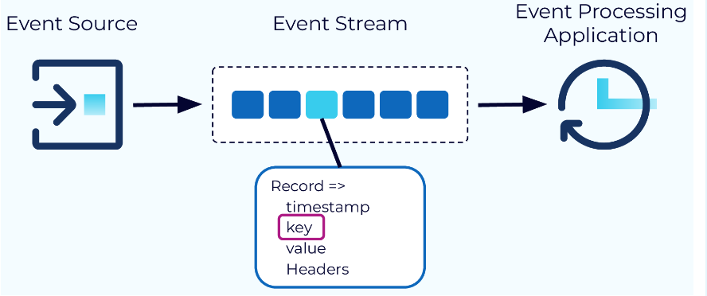

In stream processing, an event is a record capturing information about a specific occurrence, such as customer orders, payments, website clicks, or sensor readings. Events should not be excessively large, like a 10GB video. Instead, a reference to the video's location in an object store is preferable

An event record includes a timestamp, a key, a value, and optional headers. The event payload is typically stored in the value field. While the key is optional, it plays a vital role in event ordering, collocating related events across topics, and key-based storage or compaction

## Kafka Broker

Apache Kafka is built upon a network of independent machines called brokers. These brokers, which can be physical servers or containers running on virtualized servers, are responsible for hosting partitions and managing read and write requests for events. Brokers also handle replication of partitions between each other

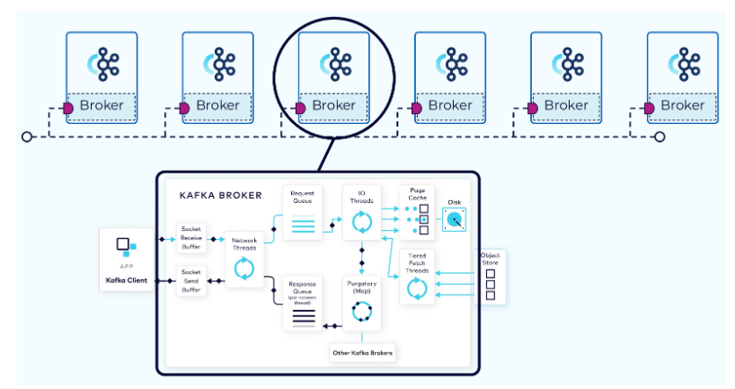

Client requests fall into two categories: produce requests and fetch requests. A produce request is requesting that a batch of data be written to a specified topic. A fetch request is requesting data from Kafka topics. 

## Data Partition

Kafka partitioning enables scalability by breaking a topic into multiple logs, each residing on a separate node in the cluster. This allows for distributing the storage, writing, and processing of messages across multiple nodes

When partitioning a topic, messages without a key are distributed evenly among partitions using a round-robin approach, sacrificing message ordering. However, messages with a key are assigned to a specific partition based on the key's hash. This ensures that messages with the same key always go to the same partition, preserving their order

Using a key, such as a customer ID, guarantees that events associated with the same customer are always ordered. While active keys may result in larger partitions, the trade-off is worth it to maintain key ordering, and any associated risks can be managed effectively

## Apache ZooKeeper

ZooKeeper is utilized by several open-source projects to provide a highly reliable control plane for distributed coordination of clustered applications through a hierarchical key-value store. The suite of services provided by ZooKeeper include distributed configuration services, synchronization services, leadership election services, and a naming registry

ZooKeeper is used in distributed systems for service synchronization and as a naming registry.  When working with Apache Kafka, ZooKeeper is primarily used to track the status of nodes in the Kafka cluster and maintain a list of Kafka topics and messages

Zooekeeper Ensemble contains Zoekeeper
Role is Cluster Management, Failure detection and recover, and Store ACLs (Access Control Lists) and secrets

- Open Source Apache Project
- Distributed Key Value Store
- Maintains configuration information
- Store ACLs (Access Control Lists) and secrets
- Enables highly reliable distributed coordination
- Provides distributed synchronization

## Summary

Producer
- Producers write Data as Messages
- Can be written in any language Java, C/C++, Python, Go, .NET, JMS REST Server for any unsupported language
- Command Line Producer Tool

Consumer
- Consumers pull messages from 1..n topics
- New inflowing messages are automatically retrieved 
- Consumer offset
	keeps track of the last message read
	Is stored in special topic
- CLI tools exist to read from cluster

## Step 1: Launch an Instance on EC2 Machine and Connect to Instance

- AWS account > EC2 > Instances > Create key pair for EC2 connection > Launch instance

- Using CLI/Terminal, SSH to connect to the EC2 Instance created

## Step 2: Installation and Set Up

- Install Kafka and Extract files using the commands

wget https://downloads.apache.org/kafka/3.3.1/kafka_2.12-3.3.1.tgz

tar -xvf kafka_2.12-3.3.1.tgz

- Install Java 1.8 as Apache Kafka runs on JVM Java Virtual Machine

java -version

sudo yum install java-1.8.0-openjdk

java -version

- Start Zookeeper

cd kafka_2.12-3.3.1

bin/zookeeper-server-start.sh config/zookeeper.properties

- Open a New CLI/Terminal windows and SSH to EC2 Machine and Start Kafka Server

export KAFKA_HEAP_OPTS="-Xmx256M -Xms128M"
to increase the memory for the Kafka Server allocate memory

cd kafka_2.12-3.3.1

bin/kafka-server-start.sh config/server.properties

ERROR: Unable to use this server as the DNS address that we use to access the Kafka server, so change the Private IP of Instance to Public IP

It is pointing to the private server, change server.properties so that it can run in public IP 

To do this, you can follow any of the two approaches below:
Do a "sudo nano config/server.properties" - change ADVERTISED_LISTENERS to public IP of the EC2 instance

Provide security access from local machine 
Edit Imbound rules to allow the request
Allow all traffic and source is MY IP 
This gives access to EC2 Machine to your local computer
A DevOps engineer usually handles the security side as allowing all traffic is not standard

- Again, Start Zookeeper Server

cd kafka_2.12-3.3.1

bin/zookeeper-server-start.sh config/zookeeper.properties

- Again, start Kafka Server

cd kafka_2.12-3.3.1

bin/kafka-server-start.sh config/server.properties

## Step 3: Create the Topic

- Open a New CLI/Terminal windows and Create the Topic

cd kafka_2.12-3.3.1

bin/kafka-topics.sh --create --topic demo_testing2 --bootstrap-server {Put the Public IP of your EC2 Instance:9092} --replication-factor 1 --partitions 1

Replace public IPv4 address from Instance summary on AWS account to create the topic

- Start Producer

bin/kafka-console-producer.sh --topic demo_testing2 --bootstrap-server {Put the Public IP of your EC2 Instance:9092} 

- Open a New CLI/Terminal windows, SSH to EC2 Instance, and Start Consumer

cd kafka_2.12-3.3.1

bin/kafka-console-consumer.sh --topic demo_testing2 --bootstrap-server {Put the Public IP of your EC2 Instance:9092}

SUCCESS: PRODUCER DATA TO CONSUMER IN REAL TIME FROM TERMINAL

## Step 4: Open Jupyter Notebook and Create Basic Kafka Producer and Kafka Consumer in Python

Basic Producer

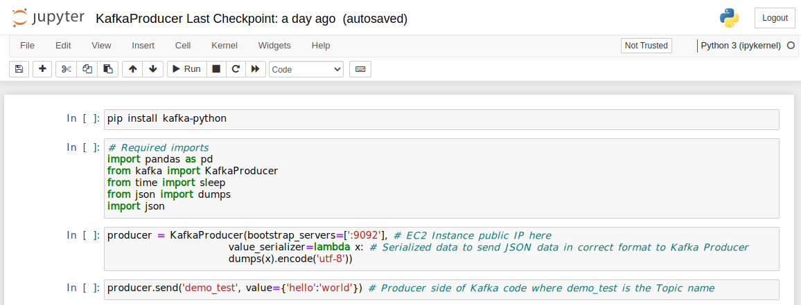

Basic Consumer 

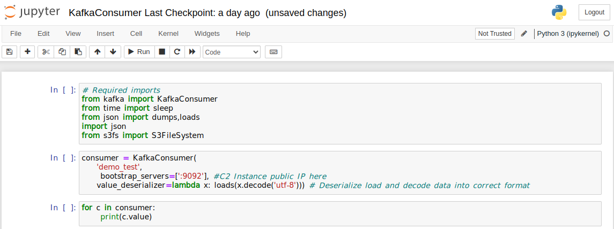

## Step 5: Integrate Stock Market Data in Producer

Usually Real Time Stock Market API can be used to gain real time stock market data
In this case we will loop the stock market data set to simulate real time data instead

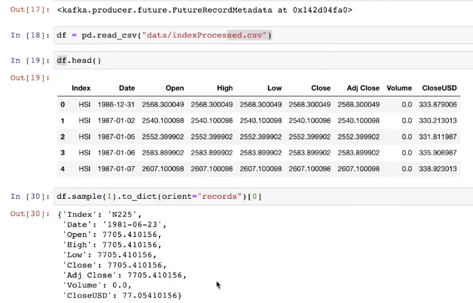

Format dataset into dictionary format using orient in pandas

DataFrame.to_dict(orient='dict', into=<class 'dict'>, index=True)[source]

Convert the DataFrame to a dictionary

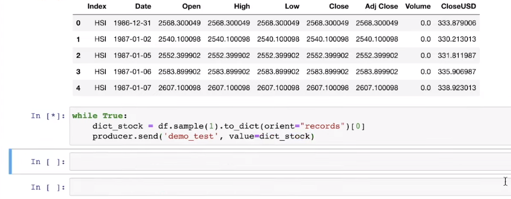

WHile loop sends Structured JSON data is sent to Kafka Server to sumulate real time data soure

## Step 6: S3 Bucket
S3 Buckets are public cloud storage containers for objects stored in simple storage service. (Amazon S3) is an object storage service offering industry-leading scalability, data availability, security, and performance

- Create S3 Bucket for Stock Market Engine

- Install AWS CLI

curl "https://awscli.amazonaws.com/awscli-exe-linux-x86_64.zip" -o "awscliv2.zip"
unzip awscliv2.zip

sudo ./aws/install

aws configure 

Paste AWS Access key ID, AWS Secret Access key, and Default region name

- Edit Consumer to Store data to S3

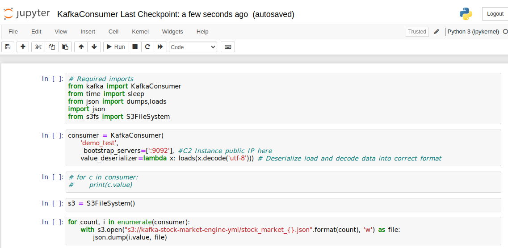

S3 bucket name used to uplaod data to S3

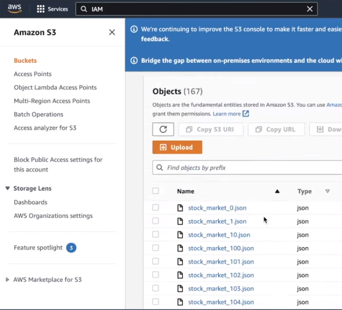

A Stock Market Event has been stored in single file on S3

## Step 7: Build a Crawler using AWS GLUE and Create AWS GLUE Data Catalog

AWS Glue is a serverless data integration service that makes it easier to discover, prepare, move, and integrate data from multiple sources for analytics, machine learning (ML), and application development

- Create a Stock Market Crawler for the S3 data > Add data source > Select the S3 bucket path created earlier. This will run the crawler on the S3 bucket (entire schema)

- Configure security settings > Select IAM role (If IAM role not created, navigate to IAM roles and create a role for Glue service, Provide Admin Access, and Create Role
(IAM role gives access to glue to read and write data on S3)

- Create a database called stock-market-kafka, select it as the target database

- Run the Crawler until State Ready

Use a crawler to populate the AWS Glue Data Catalog with tables. This is the primary method used by most AWS Glue users. A crawler can crawl multiple data stores in a single run. We have Crawled the entire schema from S3 in order to directly query on top using Athena

## Step 8: Set Up Amazon Athena

Amazon Athena is an interactive query service that makes it easy to analyze data directly in Amazon Simple Storage Service (Amazon S3) using standard SQL. We can analyze data or build applications from an Amazon Simple Storage Service (S3) data lake and 30 data sources, including on-premises data sources or other cloud systems using SQL or Python Athena is built on open-source Trino and Presto engines and Apache Spark framework

- Open Athena on AWS

- Select the database stock-market-kafka as the Data source

- Create a S3 bucket to store Athena Queries and navigate to Manage tab to select path if required

- To create real time data stream, Run KafkaProducer.py to send data on to Producer

- Run KafkaConsumer.py to consume data and upload to S3

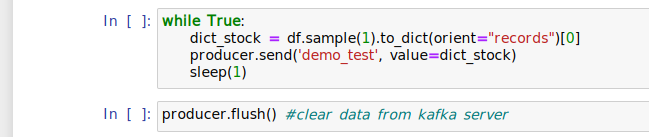

The time.sleep(1) limit in the KafkaProducer.py

Fom the Kafka Producer, we are sending data every second
From the Kafka Consumer, we are receiving the data and uploading to the S3 Bucket to simulate a real time data stream

## Step 9: Utilise Amazon Athena to query data in real time basis

- Query the Stock Market data in real time

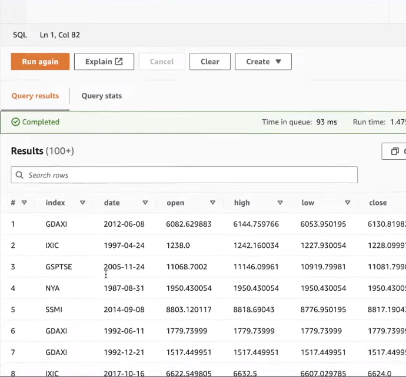

SELECT COUNT(*) FROM "stock_market_kafka", kafka-stock-market-engine-ym" limit 10;

SELECT MAX(DATE) FROM "stock_market_kafka", kafka-stock-market-engine-ym" ;

The count of Data shows that events are being uploaded to the S3 bucket increases every second

## Milestones completed 

Systematically executed the project:

- Installed Kafka on EC2 Machine
- Executed Consumer and Producer in real-time
- Simulate the data into real-time format 
- Real-time stock market API can be used in while loop
- Create JSON for dictionary format of data as required
- Build a Crawler using AWS GLUE and Create AWS GLUE Data Catalog 
- Query data in real time basis using Amazon Athena
 

